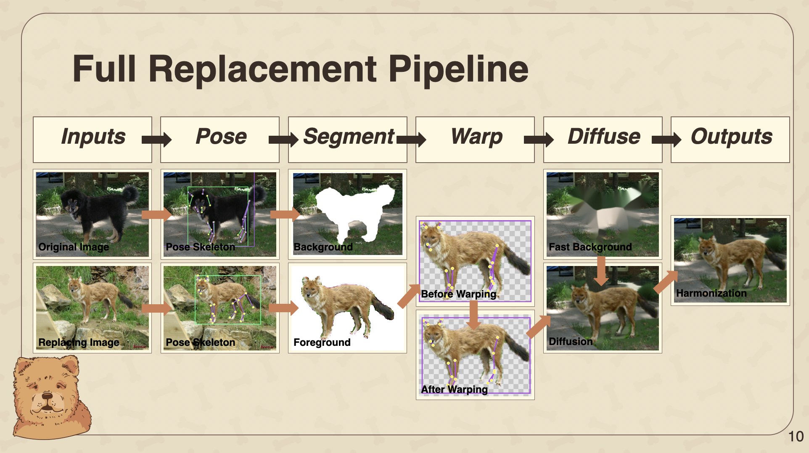
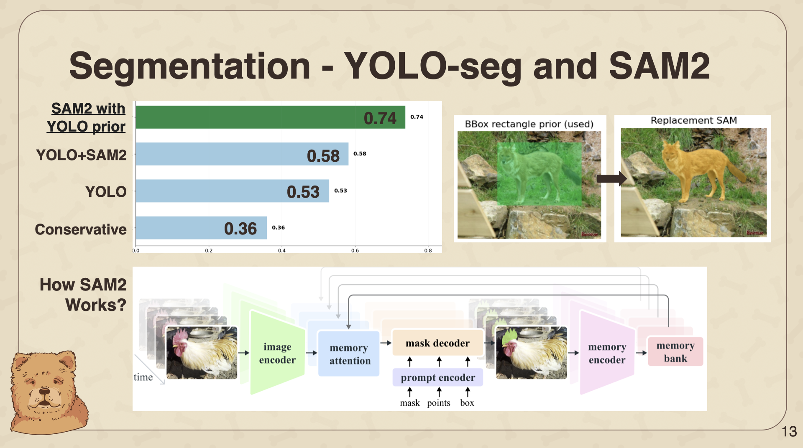
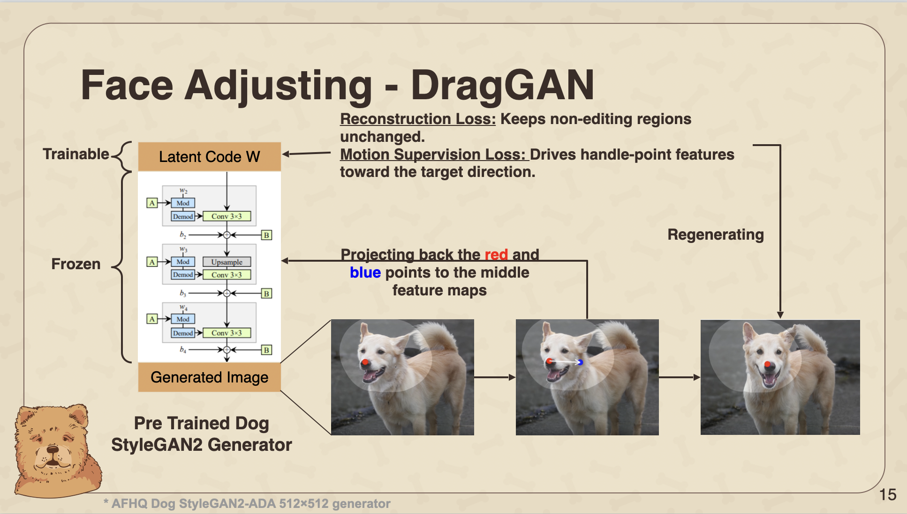
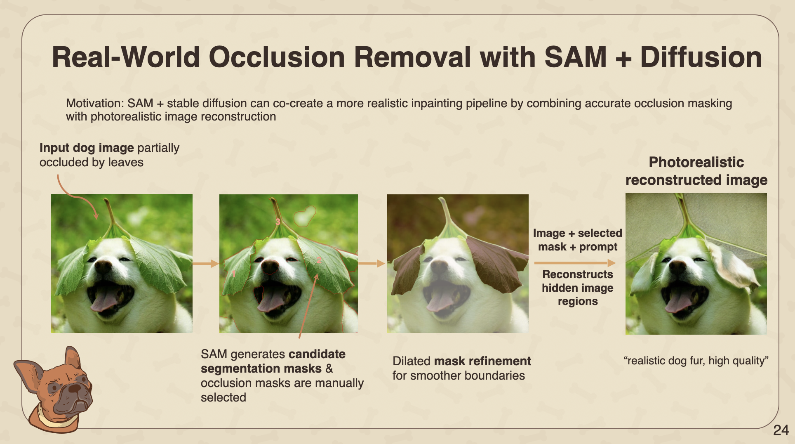
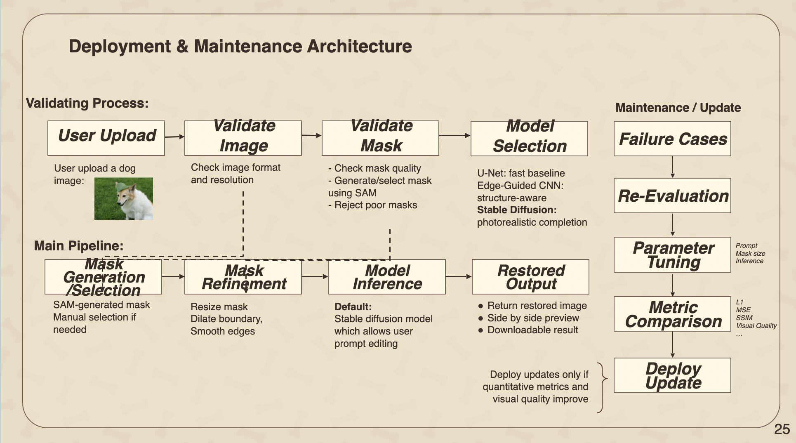

# Classifying and Reimagining Dogs with Deep Learning

An end-to-end computer vision project for understanding, replacing, and restoring dog images using deep learning. The project combines multi-task classification, pose-aware object replacement, segmentation-guided compositing, GAN-based face alignment, and diffusion inpainting into a portfolio-ready ML workflow.

## Overview

Dog photos appear across pet adoption platforms, veterinary records, insurance workflows, retail recommendation systems, and creator tools. This project explores three related capabilities:

1. **Dog image understanding:** classify a dog photo by breed and visual attributes.
2. **Dog replacement:** replace one dog with another while preserving pose, background, and realism.
3. **Dog inpainting:** reconstruct missing or occluded image regions with CNN and diffusion-based methods.

The project is notebook-first because the original work was developed experimentally, but the repository is organized as a reproducible ML project with clear docs, environment files, data instructions, and publishable results summaries.

## Visual Highlights

### Full Dog Replacement Pipeline



### Segmentation With YOLO and SAM2



### DragGAN Face Alignment



### SAM + Diffusion Inpainting



### Deployment and Maintenance Architecture



## Key Features

- Multi-task dog classification with a shared ResNet-50 backbone.
- Multi-head prediction for breed, AKC breed group, size, coat length, and image-derived coat color.
- Pose-aware dog replacement using YOLO pose estimation and keypoint-based warping.
- Segmentation-guided cutouts using YOLO segmentation and SAM/SAM2-style masks.
- DragGAN-inspired face alignment with StyleGAN2-ADA dog inversion and PTI refinement.
- Stable Diffusion, SDXL, RealVisXL, and RealisticVision inpainting experiments.
- CNN inpainting baselines with U-Net and edge-guided completion networks.
- Region-aware evaluation using boundary MAE, edited-region LPIPS, SSIM, and cycle consistency.

## Dataset

The primary dataset is the **Stanford Dogs Dataset**, containing 20,580 dog images across 120 breeds. The classification notebook indexes 20,579 valid images after preprocessing and uses a 70/15/15 train-validation-test split.

Dataset source:

- Stanford Dogs Dataset on Kaggle: https://www.kaggle.com/datasets/jessicali9530/stanford-dogs-dataset

Expected local layout:

```text
data/
├── raw/
│   └── stanford-dogs-dataset/
├── interim/
├── processed/
└── README.md
```

Large raw datasets, checkpoints, and generated outputs are intentionally excluded from Git. See `data/README.md` and `models/README.md` for restoration instructions.

## Methodology

### Problem 0: Multi-Task Classification

The classifier fine-tunes an ImageNet-pretrained ResNet-50 backbone and attaches multiple task-specific heads. A single forward pass predicts:

- Breed: 120 classes.
- Breed group: 8 AKC-style groups.
- Size: 5 classes.
- Coat length: 3 classes.
- Coat color: pseudo-labels derived from image color statistics.

Training uses AdamW, separate learning rates for the backbone and task heads, cosine scheduling, weighted sampling, and a weighted multi-task loss:

```text
total loss = breed loss + 0.5 * (group loss + size loss + coat loss)
```

### Problem 1: Pose-Aware Dog Replacement

The replacement pipeline takes an original image and a replacement dog image, then produces a composite where the replacement dog fits the original scene.

Pipeline stages:

1. Detect dogs with YOLO.
2. Estimate dog pose with a fine-tuned YOLO-v11n pose model using 24 keypoints.
3. Segment the original and replacement dogs using YOLO segmentation and SAM/SAM2-style masks.
4. Gate feasible pairs based on detectability, keypoint overlap, pose similarity, and estimated warp error.
5. Align replacement body pose with similarity transforms and piecewise affine warping.
6. Optionally align the dog face through StyleGAN2-ADA inversion, PTI, and DragGAN-style latent editing.
7. Repair seams and missing regions with local diffusion inpainting.
8. Apply post-generation harmonization for boundary and color consistency.

Evaluation uses cycle replacement: replace dog A with dog B, then replace B back with A and compare the reconstruction against the original.

### Problem 2: Dog Image Inpainting

The inpainting workflow compares three approaches on synthetically masked dog images:

- **U-Net baseline:** encoder-decoder CNN for pixel-level reconstruction.
- **Edge-guided CNN:** predicts structural edges and uses them to guide RGB completion.
- **Stable Diffusion inpainting:** uses a pretrained diffusion model for photorealistic semantic completion.

A SAM-guided demo extends the workflow to real-world occlusion removal, where masks can be selected/refined before diffusion inference.

## Results

### Multi-Task Classification

| Task | Classes | Held-Out Test Accuracy |
|---|---:|---:|
| Breed | 120 | 86.1% |
| Breed Group | 8 | 94.1% |
| Size | 5 | 91.5% |
| Coat Length | 3 | 95.1% |
| Coat Color | image-derived pseudo-labels | 71.3% |

Training completed in about 25 minutes for 8 epochs. Best validation breed accuracy was 87.2%.

### Dog Replacement Component Ablations

Small controlled pilot benchmark using three image pairs and cycle-consistency scoring.

| Component | Best Variant | Cycle Score | Runtime | Boundary MAE | LPIPS |
|---|---|---:|---:|---:|---:|
| Segmentation | SAM using YOLO bbox prior | 0.738 | 3.20 | 44.57 | 0.2347 |
| Pose / Face Alignment | Face-DragGAN face only | 0.929 | 20.66 | 35.43 | 0.2332 |
| Diffusion | RealVisXL V4 inpainting | 0.988 | 3.55 | 38.09 | 0.2164 |
| Face-DragGAN Tuning | Fast PTI setting | 0.882 | 13.65 | 42.64 | 0.2344 |

Interpretation: diffusion and segmentation choices strongly affect boundary realism and perceptual quality. Face alignment improves local realism but increases runtime.

### Dog Inpainting

| Method | L1 ↓ | MSE ↓ | PSNR ↑ | SSIM ↑ | Notes |
|---|---:|---:|---:|---:|---|
| U-Net baseline | 0.0142 | 0.0035 | 24.61 | - | Stable baseline, often blurry |
| Edge-guided CNN | 0.0119 | 0.0026 | - | - | Better structure preservation |
| Stable Diffusion inpainting | 0.0369 | 0.0058 | 23.31 | 0.756 | Stronger perceptual realism, weaker pixel fidelity |

Pixel metrics are most useful for synthetic masks. Diffusion outputs should also be judged visually because generative models produce plausible completions rather than exact reconstructions.

## Repository Structure

```text
dog-vision-deep-learning/
├── README.md
├── requirements.txt
├── environment.yml
├── .gitignore
├── data/
│   └── README.md
├── notebooks/
│   ├── classification/
│   ├── dog_replacement/
│   └── inpainting/
├── src/
│   ├── classification/
│   ├── dog_replacement/
│   ├── inpainting/
│   └── utils/
├── models/
│   └── README.md
├── outputs/
│   └── examples/
├── scripts/
├── slides/
├── docs/
└── assets/
```

## Installation

Recommended GPU setup:

```bash
conda env create -f environment.yml
conda activate dog-vision
python -m ipykernel install --user --name dog-vision --display-name "Python (dog-vision)"
```

Pip-only setup:

```bash
python -m venv .venv
source .venv/bin/activate
pip install --upgrade pip
pip install -r requirements.txt
```

## Usage

Run notebooks in this order:

```text
notebooks/classification/01_multitask_classification.ipynb
notebooks/dog_replacement/main_pipeline/00_train_dog_pose_colab.ipynb
notebooks/dog_replacement/main_pipeline/00_dog_pose_indexing.ipynb
notebooks/dog_replacement/main_pipeline/00_5_pair_feasibility.ipynb
notebooks/dog_replacement/main_pipeline/00_6_query_replacement_candidates.ipynb
notebooks/dog_replacement/main_pipeline/01_enhanced_dog_replacement.ipynb
notebooks/dog_replacement/main_pipeline/02_pose_guided_warp_and_paste.ipynb
notebooks/dog_replacement/main_pipeline/03_diffusion_refinement.ipynb
notebooks/dog_replacement/main_pipeline/04_post_generation_harmonization.ipynb
notebooks/dog_replacement/main_pipeline/05_comparison_visualization.ipynb
notebooks/inpainting/cv_final_q3_01_UNet.ipynb
notebooks/inpainting/cv_final_q3_02_edge_generator.ipynb
notebooks/inpainting/cv_final_q3_03_image_completion.ipynb
notebooks/inpainting/cv_final_q3_05_full_stable_diffusion.ipynb
notebooks/inpainting/cv_final_q3_06_SAM_Demo.ipynb
```

Run the replacement ablation script:

```bash
python scripts/run_cycle_comparison.py --list-variants
python scripts/run_cycle_comparison.py --groups A,B,C,D,E --max-pairs 3 --skip-existing
```

## Future Work

- Refactor notebook logic into reusable Python modules under `src/`.
- Add CLI entrypoints for classification, replacement, inpainting, and evaluation.
- Replace hardcoded Colab/Drive paths with YAML configuration.
- Add lightweight demo assets that can be committed publicly.
- Automate SAM mask selection and mask-quality validation.
- Evaluate replacement on a larger, more diverse benchmark.
- Add faster diffusion backends or distilled inpainting models for deployment.
- Package trained checkpoints through GitHub Releases, Hugging Face, or cloud storage.

## Authors

- yining mao
- Jenny Dong
- Sharon Lee
- Steven Si
